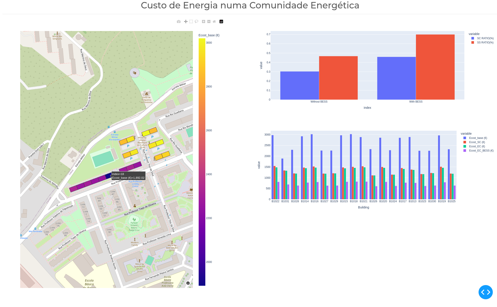

# dash-energy-community
## Example

---
Be sure to create a virtual environment and activate it before proceding with the installation: [instructions](https://docs.python.org/3/library/venv.html) 
## Installation

### Linux:
```shell
python3 -m pip install -r requirements.txt
```

### Windows:
```shell
python -m pip install -r requirements.txt
```

## Usage

### Linux:
```shell
python3 app.py
```

### Windows:
```shell
python app.py
```
